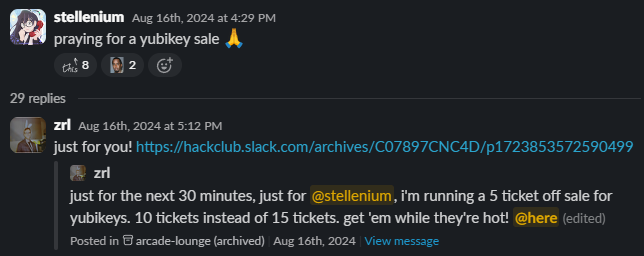
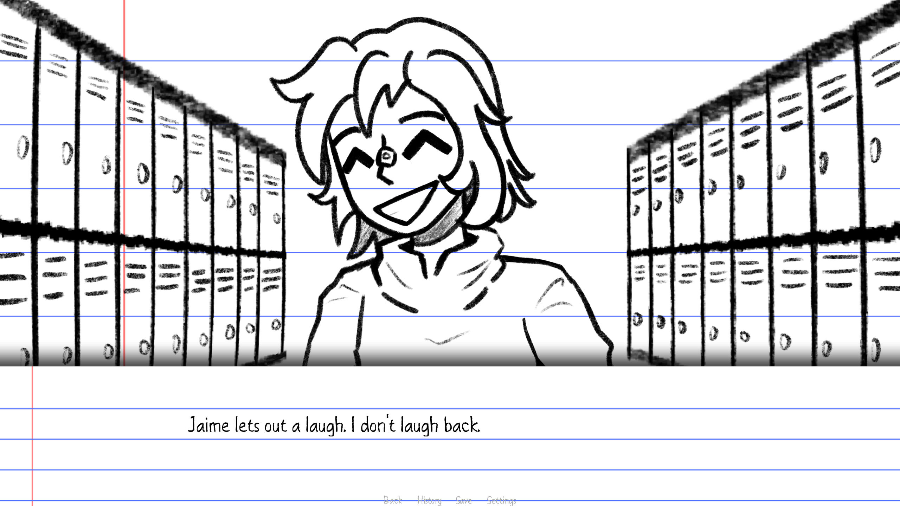
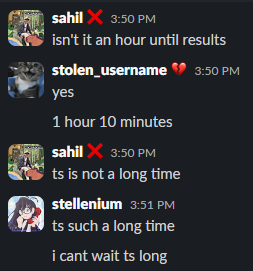
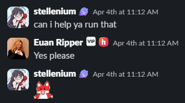

Two years ago today, I joined Hack Club.

It was August 1st, 2024; I was chilling in my grandparents' home in Vietnam, checking my email (as you do when you're bored), when I received a GitHub newsletter telling me about a program for teens called "Arcade." It was run by this nonprofit called Hack Club, and you could earn prizes like free iPads and YubiKeys... and all you had to do was code!

I didn't have much better to do that summer, so I decided to join the program and see what was up. And so, I made some silly websites, a Sprig game, and I got my tickets to use in the shop. I even managed to convince Zach Latta to put the YubiKey on sale, so I could afford it.

I proceeded to participate in a few other Hack Club programs, like OnBoard, as well as receive my own Sprig kit (which I still haven't built to this day), but eventually I started to lose interest in Hack Club as I ran out of things to do, and found interest in other things, such as broadcast journalism and filmmaking. But I never left Hack Club, and as I used Slack for other things, the workspace icon stayed there as a stark reminder of what I had left behind.

I would occasionally come back and ship a project to a cool looking program - but I wouldn't make a substantial return to Hack Club until January of this year, when I received an email from one Renran Sun, telling me about her program [Storyboard](https://storyboard.hackclub.com/), where you could make a visual novel (something I'd always wanted to do) and get various prizes, like an IKEA plushie (blahaj...) or even a whole keyboard!

I was sold! After some experimenting with different ideas, I settled on a simple one that I could use as "practice" for a bigger game I could spend a longer time working on. In the span of 4 days, I worked for 14 hours, writing and coding the visual novel, while my friend drew adorable little assets to go along with it. The final result was a 10-minute-long sketchbook visual novel titled "Rough Sketches," which told the story of a kid (aptly named Kid) and their first day troubles at school. You can play it [here](https://stellenium.itch.io/rough-sketches)!

I ended up not submitting this project to Storyboard - instead, I submitted it to [Hack Club: The Game](https://game.hackclub.com/), a scavenger hunt-style event across New York City, inspired by the gameshow [Jet Lag: The Game](https://www.youtube.com/c/jetlagthegame). As a huge fan of the inspiration, I knew instantly I had to participate! I asked my parents, started making projects, and it was off to the races.

I slowly became engaged with the HCTG community, first becoming a familiar face around the Slack channels, helping where I could, then becoming a community team member, hosting lock-in huddles and game nights, and then becoming a reviewer, reviewing people's projects! Through this, I was able to meet some amazing people I'm glad to call my friends today ([@queso](https://hackclub.enterprise.slack.com/team/U09AFPZ852L) and [@swn](https://hackclub.enterprise.slack.com/team/U091G6M9AB0)) and the incredibly hardworking organizers working at HQ & from home ([@radioblahaj](https://www.radioblahaj.com/), [@phthallo](https://phthallo.com/), [@ascpixi](https://github.com/ascpixi/), and [@iamalive](https://ckacha.dev/)).

One fateful day in March, while thinking of projects to work on for HCTG, I found out that Hack Club had opened up applications for their internship program under the You Ship, We Ship (YSWS) department! I had always wanted to run my own YSWS program (a program where teens ship projects, and Hack Club ships them prizes), so this seemed like the perfect opportunity. After a lot of obsessing over getting the perfect idea, I came up with something I was happy with. I called it: "onekey." It was a simple idea - make a project that only uses one key, and we'll ship you a macropad that only has one key (as well as other prizes.) I submitted my application, and impatiently waited for a response.

On Friday, March 27th, I come home from school and join a huddle (Slack's call feature) with other stressed applicants, awaiting my results. While casually checking my email, a new one appears in my inbox. The first two words read: "You're in."

Oh shittings.

As news spreads that I've landed the Hack Club internship, I quickly gain popularity across the Slack, with my personal channel gaining hundreds of members in the span of a month. I start working on HQ projects, such as [the Hack Club Stickers website](https://stickers.hackclub.com/) and gain the chance to pitch interesting things to HQ people.

I meet the other interns, the people I'll be sharing a whole month of my summer with - and they're all awesome. Notably, I meet [@ivie](https://ivie.codes/), [@jenin](https://jenin.codes/), [@kat](https://www.kat.wang/), and [@1mon](https://github.com/2Mon), who will be my closest friends throughout the internship!

Come late May, I flew to New York City and had the most fun I've ever had at any event, ever. The magical experience locked me in as a Hack Clubber for life. If you're curious about what a Hack Club IRL event is like, and you'd like to hear a little bit about HCTG, DM me on Slack [@stellenium](https://hackclub.enterprise.slack.com/team/U07F6FMJ97U), or email me! I'd love to chat about it.

Finally, in late June, Hack Club flies me out to Vermont for my internship! Blog post on this coming soon™ - stay tuned!

To reflect upon my two years at Hack Club, it's been nothing short of lifechanging. To be fair, with the time that I had at Hack Club, I could have easily done way way more... but I didn't. I wasted a lot of my time, doing nothing. But...

There's a famous saying that goes like: "The best time to plant a tree is 20 years ago. The second best time is now."

I'm here now. And I've had the chance to build awesome things at Hack Club. And I'm gonna keep building even crazier things.

Thank you, Hack Club, for a great two years. I hope to have a lot to talk about next year :)