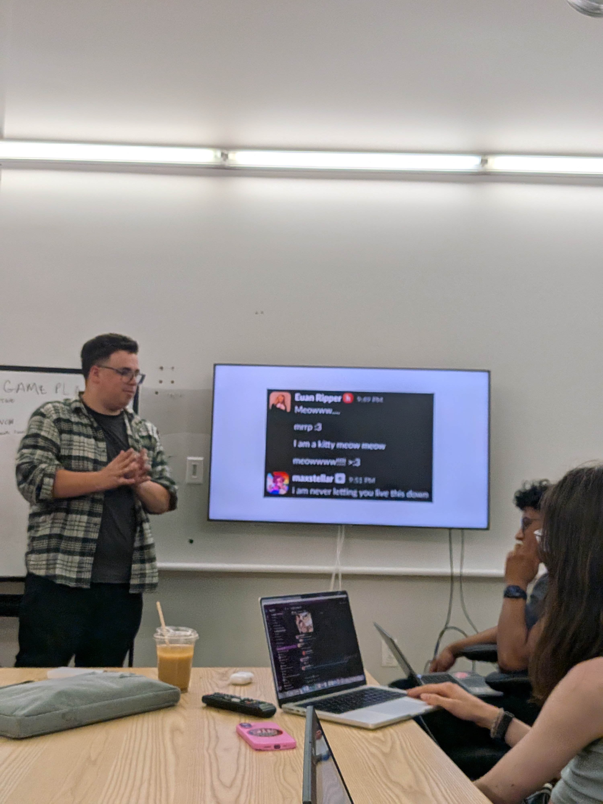
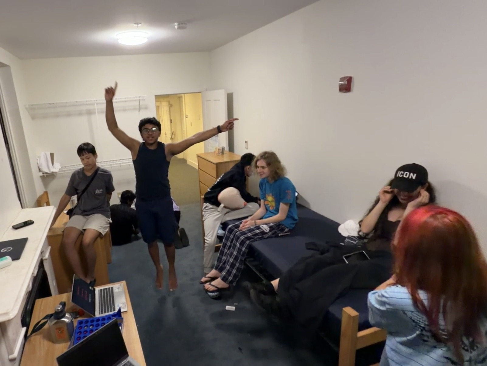
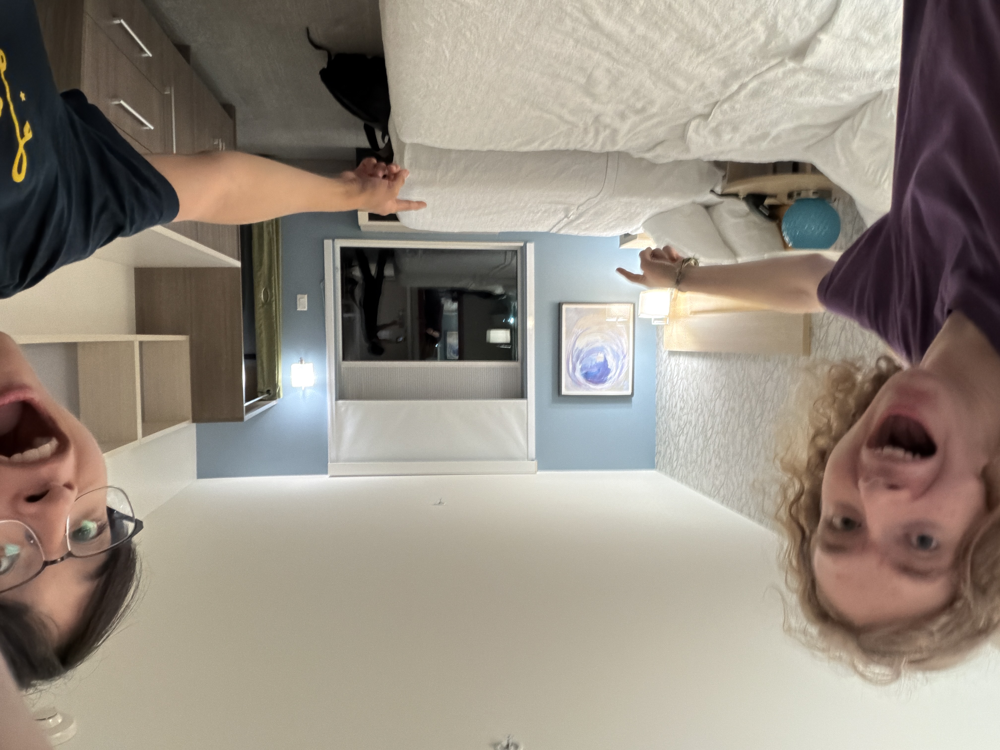
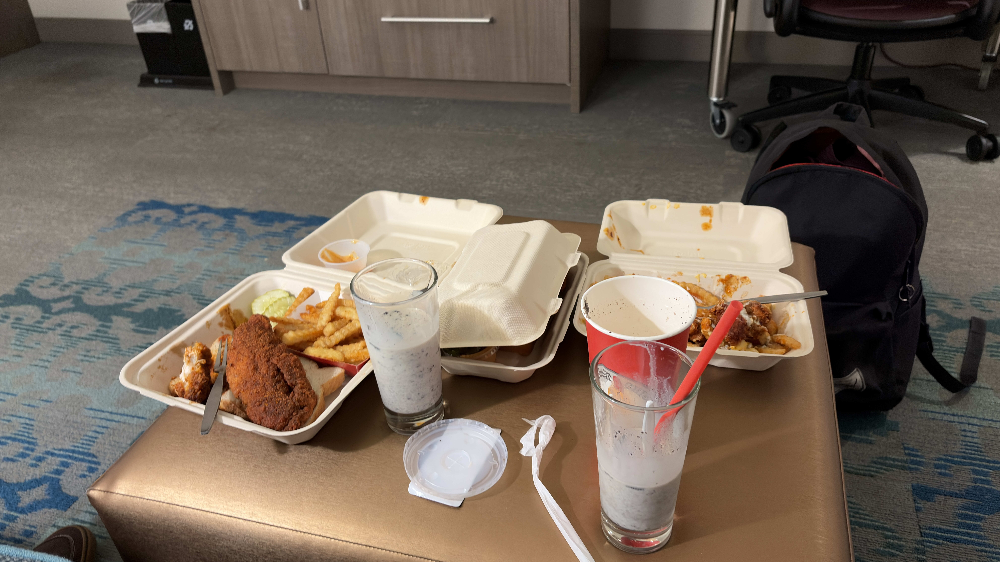
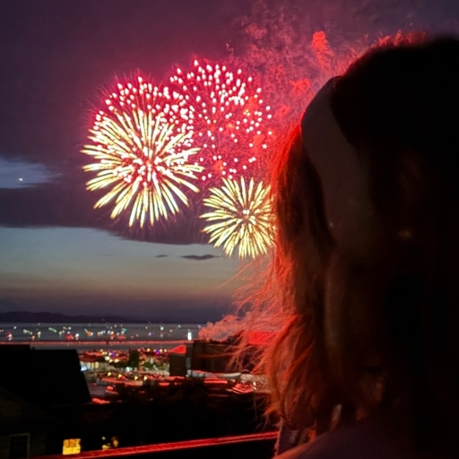
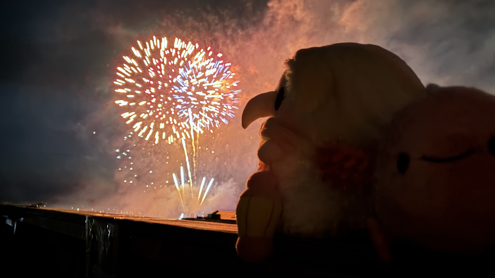

> Dedicated to Ivie, Max, Kat, Jenin, Safia, Dhyan, Candy, Matthew, Shurui, Lynn, Ian, and everybody else I had the absolute pleasure of at HQ. Thank you for making this the most special summer ever. Although our time together may be over now, I'll never forget all the late nights we spent in the lounge, on the couches in front of the TV, or in a little dimly-lit corner outside on the Champlain College campus. I have so much love for all of you, and I hope to see you all soon :)

It's March 27th, 2026, and I've just gotten home from getting dinner with my dad after a long day of school. The day has been a blur - although I have been trying my best to pay attention in my classes, my mind can only think of one thing: will I get accepted to the Hack Club internship?

I'm in a call with all of the people in [#stressed-interns-26](https://hackclub.enterprise.slack.com/archives/C0AN059DDHB) as we impatiently wait for the results to come out (our internship result emails were promised to us 3000 years ago). People pretend to receive their acceptance emails ("OH MY GOD GUYS I GOT AN EMAIL! ...from hot topic, i got a 40% off coupon"), at other people's annoyance.
I refresh my email as a joke, expecting to see nothing.

And then it happens.

And then the screaming ensues.

The yells and hollers coming from me and another intern, Tanishq ([@Tanuki](https://github.com/TaniWanKenobi)), drown out the world. For just a moment, it's just me, a pure rush of dopamine, and my dreams playing out in front of my eyes. Oh shittings. It's really happening.

From then on, it's a blur. I begin to gain notability on the Slack for being an intern, my personal channel quickly grows to become one of the largest on the Slack, and gap years begin to loop me in on HQ projects. I'm your favorite nepo baby's favorite nepo baby.

The wait until June 21st can't possibly feel any longer. Every day becomes a battle of endurance - I must make it to Hack Club: The Game. I must make it to the internship.

> [!NOTE]
> I'm only really going to write about the most notable of days, the most fun events, and generally just what I can remember. Everything else isn't super important :)

## making it to the internship (june 21)
It's 3AM on Sunday, June 21st. To be honest, I'd be lying if I said I was tired at all - I was too excited.

I meet up with Rushil ([@Rushmore](https://github.com/MntRushmore)), and we check our bags and make our way through security.
The journey to Burlington is arduous and filled with delays, and I remember freaking out about our rooming qualms with Ivie on Slack while waiting out our flight delay in Charlotte (our layover airport).
However, me and Rushil finally get to Vermont around 8PM, and... it's wonderful.
I enter the dorms to be greeted by the other interns, but most notably Ivie, one of the only interns I could have really called a close friend at this time. We wave to each other awkwardly and decide to get dinner together outside- and my roommate, Soon, tags along.
We frantically scurry from restaurant to restaurant, only for all of them to be closed. It's Father's Day. Everything closes early. And so, that's how we ended up getting Five Guys for dinner on the first day of the internship.

## first day at work! (june 22)
Although I usually hate Mondays, my first ever day at HQ (and at work) is an exciting one! I make myself at home on the nice red leather couch next to the wagon I thought was a table (but works as one anyways) and get to work.
Deven pulls us into a meeting where he essentially tells us that none of our programs will get close to 150 weighted projects (spoiler alert: he was right), but we should still try our best. He gives us very good feedback on all of our YSWSes and sends us off to prepare for launch!

I don't remember much else from this day because I was so insanely locked in (trust) but it was very very fun :)

## presentation night (june 23)
A few of the interns had planned out activities for the month, one of which was "powerpoint roulette." (It was me. It was my idea.)

Each of us made an extremely cursed presentation to present to the others, with one fun catch - we would be presenting one of the others' presentations. And, uh... there wasn't a lot of context for most of these presentations. This is why improv is a valuable life skill!

## karaoke in the lounge, way past quiet hours (june 28)
It was the Sunday night after an outing to a waterfall (that I didn't go to, because I hate getting wet), and as usual, the intern dorms' lounge had gathered a small crowd of people who were all rather bored. We play a few games of mafia, with myself and Tanishq acting as the narrators; a callback to a short visit to Nick's ([@bunnyguy](https://sundial.city/)) apartment, where we probably should have been quieter.

After a round or two, we begin to get bored, and start playing Hamilton songs - and the thing about Hamilton songs is, if you know the lyrics, it's hard to stop yourself from singing along. Then Hamilton karaoke turns into regular karaoke... and then suddenly, everyone is singing, dancing, and jumping along to Miley Cyrus's "Party in the USA."

## such a thing as free lunch! (june 29)
Evan Streams, the commmunity manager at Hack Club, graciously takes all the interns out for a mandatorily optional lunch with the founder of [Seventh Generation](https://www.seventhgeneration.com/), a company based out of Burlington that makes eco-friendly products - most notably, the laundry detergent that I use.

I enjoy a local root beer and a decent burger while we ask questions about sustainability, non-profits, the government, and more. The man has a large but unsurprising amount of wisdom.

## hotel room!!! (july 2)
After arriving home from work, a broken AC in both me and Max's ([@1mon](https://github.com/2Mon)) rooms in the middle of a heatwave means 90*C temperatures... we're getting a hotel room!

After a short bit of panic, contacting our parents, getting our parents to contact Rebeka, and then getting Rebeka to contact the dorm parent... we're golden! My dad (who is in Vermont) arrives to pick me and Max up, and we go to our hotel that we'd reserved a room with on the phone... only to find out that they had no availability! Apparently, they had called back to let us know, but Max's phone didn't get the call. So now, it's 11pm at night, and we're scurrying around the lobby of a hotel, calling around, trying to see if any hotels near us have availability. And then- bingo!

The hotel we land on is a bit far from the city, but it's extremely nice... the beds are big and comfy, the room is large and spacious, and there are PLATES. And a dishwasher!

We're both pretty hungry, so we decide to get Dave's Hot Chicken delivered to our hotel. 1AM Dave's Hot Chicken HITS.

Then, I settle into bed to watch some YouTube... and inevitably drift off to sleep.

## hotel room, part 2: electric boogaloo (july 3)
Oh yeah! It's a holiday. We have the day off today. Forgot to mention it yesterday.

I wake up feeling well-rested (probably the best sleep I'd had in about 2 weeks) and realize Max had gently closed my laptop for me (but had not moved it, cause he thought that'd be weird.) We laze around in bed a little more, call the front desk to ask for a delayed check out, and watch stupid YouTube videos together until it's time to check out. We gather all of our belongings and say goodbye to the room- we'll miss you.

We head back to the intern dorms at around 12pm, where we spend the rest of our day hanging out with Ivie, getting dinner together. We meet up with Nick and explore the candy store across from Ben and Jerry's, where me and Ivie buy two little adorable plushies, one for each of us. We named them after sweets, since we got them from the candy store. They're dating, we decided. And they're both girls. It's yuri!!!

Burlington is weird, as it does fireworks on the 3rd instead of the 4th - so after dinner, we decide to go see the fireworks on the roof of HQ, where we find Kat and Jenin. I take plenty of pictures of Ivie, determined to get her a new pfp. It works!

     

Overall, these two days become two of my favorite days of the entire internship. Getting to spend time alone with the people I love, just doing the simplest things and having fun while doing it - simply magical.

## to be continued...