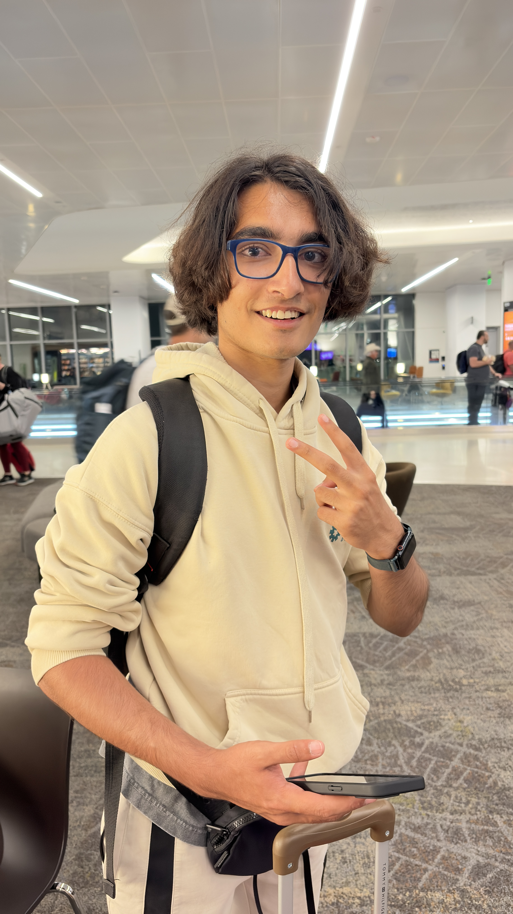

> Dedicated to Ivie, Max, Kat, Jenin, Safia, Dhyan, Candy, Matthew, Shurui, Lynn, Ian, and everybody else I had the absolute pleasure of at HQ. Thank you for making this the most special summer ever. Although our time together may be over now, I'll never forget all the late nights we spent in the lounge, on the couches in front of the TV, or in a little dimly-lit corner outside on the Champlain College campus. I have so much love for all of you, and I hope to see you all soon :)

It's March 27th, 2026, and I've just gotten home from getting dinner with my dad after a long day of school. The day has been a blur - although I have been trying my best to pay attention in my classes, my mind can only think of one thing: will I get accepted to the Hack Club internship?

I'm in a call with all of the people in [#stressed-interns-26](https://hackclub.enterprise.slack.com/archives/C0AN059DDHB) as we impatiently wait for the results to come out (our internship result emails were promised to us 3000 years ago). People pretend to receive their acceptance emails ("OH MY GOD GUYS I GOT AN EMAIL! ...from hot topic, i got a 40% off coupon"), at other people's annoyance.
I refresh my email as a joke, expecting to see nothing.

And then it happens.

And then the screaming ensues.

The yells and hollers coming from me and another intern ([@Tanuki](https://github.com/TaniWanKenobi)) drown out the world. For just a moment, it's just me, a pure rush of dopamine, and my dreams playing out in front of my eyes. Oh shittings. It's really happening.

From then on, it's a blur. I begin to gain notability on the Slack for being an intern, my personal channel quickly grows to become one of the largest on the Slack, and gap years begin to loop me in on HQ projects. I'm your favorite nepo baby's favorite nepo baby.

The wait until June 21st can't possibly feel any longer. Every day becomes a battle of endurance - I must make it to Hack Club: The Game. I must make it to the internship.

> [!NOTE]
> I'm only really going to write about the most notable of days, the most fun events, and generally just what I can remember. Everything else isn't super important :)

## making it to the internship (june 21)
It's 3AM on Sunday, June 21st. To be honest, I'd be lying if I said I was tired at all - I was too excited.

I meet up with Rushil ([@Rushmore](https://github.com/MntRushmore)), and we check our bags and make our way through security.
The journey to Burlington is arduous and filled with delays, and I remember freaking out about our rooming qualms with Ivie on Slack while waiting out our flight delay in Charlotte (our layover airport).
However, me and Rushil finally get to Vermont around 8PM, and... it's wonderful.
I enter the dorms to be greeted by the other interns, but most notably Ivie, one of the only interns I could have really called a close friend at this time. We wave to each other awkwardly and decide to get dinner together outside- and my roommate, Soon, tags along.
We frantically scurry from restaurant to restaurant, only for all of them to be closed. It's Father's Day. Everything closes early. And so, that's how we ended up getting Five Guys for dinner on the first day of the internship.

## first day! (june 22)
Although I usually hate Mondays, my first ever day at HQ (and at work) is an exciting one! I made myself at home on the nice red leather couch next to the wagon I thought was a table (but works as one anyways) and get to work.
Deven pulls us into a meeting where he essentially tells us that none of our programs will get close to 150 weighted projects (spoiler alert: he was right), but we should still try our best. He gives us very good feedback on all of our YSWSes and sends us off to prepare for launch!

I don't remember much else from this day because I was so insanely locked in (trust) but it was very very fun :)